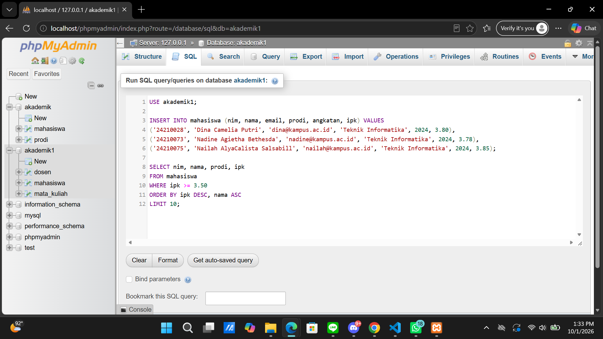
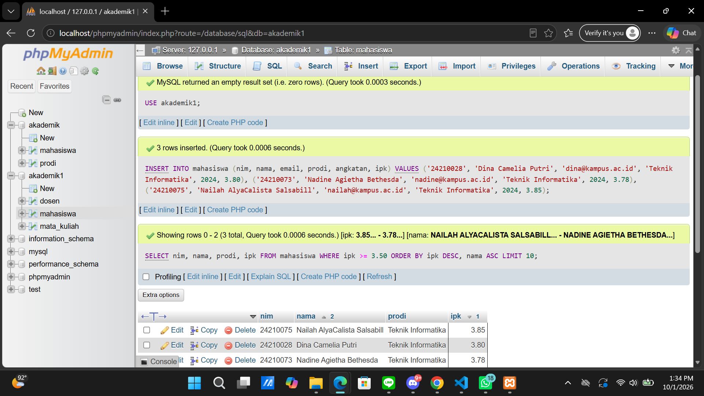
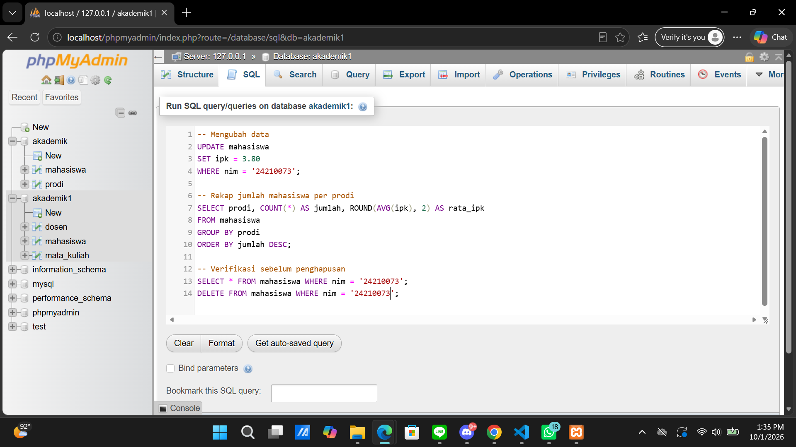
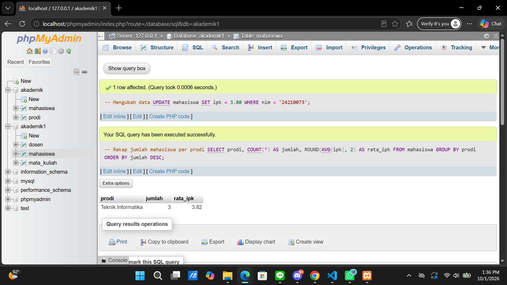

# LAPORAN PRAKTIKUM PEMROGRAMAN BERBASIS WEB

**Identitas Mahasiswa:**
* **Nama:** Nailah AlyaCalista Salsabill
* **NPM:** 4524210075
* **Kelas:** B
* **Mata Kuliah:** Praktikum Pemrograman Berbasis Web
* **Program Studi:** Teknik Informatika - Universitas Pancasila

---

# PERTEMUAN 4: SQL QUERY DASAR (DML, WHERE, ORDER BY, GROUP BY, LIMIT)

## 1. Eksekusi Kode Contoh (Output Tanpa Error Kritis)
Menjalankan seluruh perintah manipulasi data (DML) sesuai latihan Laporan Pertemuan 4 pada tabel `mahasiswa` di database `akademik1`.

```sql
USE akademik1;

-- 1. INSERT Multiple Data Mahasiswa (Latihan Kode Program A)
INSERT INTO mahasiswa (nim, nama, email, prodi, angkatan, ipk) VALUES
('24210028', 'Dina Camelia Putri', 'dina@kampus.ac.id', 'Teknik Informatika', 2024, 3.80),
('24210073', 'Nadine Agietha Bethesda', 'nadine@kampus.ac.id', 'Teknik Informatika', 2024, 3.78),
('24210075', 'Nailah AlyaCalista Salsabill', 'nailah@kampus.ac.id', 'Teknik Informatika', 2024, 3.85);

-- 2. SELECT Query dengan Filter WHERE, ORDER BY & LIMIT
SELECT nim, nama, prodi, ipk
FROM mahasiswa
WHERE ipk >= 3.50
ORDER BY ipk DESC, nama ASC
LIMIT 10;

-- 3. UPDATE Data Mahasiswa (Latihan Kode Program B)
UPDATE mahasiswa
SET ipk = 3.80
WHERE nim = '24210073';

-- 4. GROUP BY & Aggregation (Rekap Mahasiswa & Rata-rata IPK per Prodi)
SELECT prodi, COUNT(*) AS jumlah, ROUND(AVG(ipk), 2) AS rata_ipk
FROM mahasiswa
GROUP BY prodi
ORDER BY jumlah DESC;

-- 5. Verifikasi & DELETE Data
SELECT * FROM mahasiswa WHERE nim = '24210073';
DELETE FROM mahasiswa WHERE nim = '24210073';
```

---

## 2. Modifikasi Bermakna (Minimal 2 Modifikasi)

### Modifikasi 1: Query Filter Lanjutan Menggunakan Operator `LIKE` dan `AND`
Menampilkan data mahasiswa yang menggunakan domain email resmi `@kampus.ac.id` serta memiliki nilai IPK di atas 3.80.
```sql
SELECT nim, nama, email, prodi, ipk 
FROM mahasiswa 
WHERE email LIKE '%@kampus.ac.id' AND ipk >= 3.80
ORDER BY ipk DESC;
```

### Modifikasi 2: Query Filter Agregasi Menggunakan `GROUP BY` + `HAVING`
Menampilkan rekapitulasi program studi yang memiliki rata-rata IPK mahasiswa di atas 3.75 dengan klausa `HAVING`.
```sql
SELECT prodi, COUNT(*) AS total_mhs, ROUND(AVG(ipk), 2) AS avg_ipk
FROM mahasiswa
GROUP BY prodi
HAVING AVG(ipk) > 3.75
ORDER BY avg_ipk DESC;
```

---

## 3. Penjelasan 5 Bagian Kode Paling Penting (Pertemuan 4)

1. **`SELECT ... WHERE`**:
   * *Kode:* `SELECT nim, nama, prodi, ipk FROM mahasiswa WHERE ipk >= 3.50;`
   * *Penjelasan:* Menyaring baris data agar hanya menampilkan record mahasiswa yang memenuhi kondisi kriteria tertentu (IPK >= 3.50).

2. **`ORDER BY ... DESC, ... ASC`**:
   * *Kode:* `ORDER BY ipk DESC, nama ASC`
   * *Penjelasan:* Mengurutkan hasil tampilan pencarian data berdasarkan kolom IPK secara menurun (tertinggi ke terendah), lalu berdasarkan nama secara menaik (A-Z).

3. **`UPDATE ... SET ... WHERE`**:
   * *Kode:* `UPDATE mahasiswa SET ipk = 3.80 WHERE nim = '24210073';`
   * *Penjelasan:* Memperbarui nilai kolom `ipk` menjadi `3.80` khusus pada baris data mahasiswa ber-NIM `'24210073'`.

4. **`GROUP BY` dan Fungsi Agregasi (`COUNT`, `ROUND(AVG())`)**:
   * *Kode:* `SELECT prodi, COUNT(*) AS jumlah, ROUND(AVG(ipk), 2) AS rata_ipk FROM mahasiswa GROUP BY prodi;`
   * *Penjelasan:* Mengelompokkan baris data berdasarkan nilai program studi, kemudian menghitung total mahasiswa (`COUNT`) dan rata-rata IPK yang dibulatkan 2 digit di belakang koma (`ROUND(AVG())`).

5. **`DELETE FROM ... WHERE`**:
   * *Kode:* `DELETE FROM mahasiswa WHERE nim = '24210073';`
   * *Penjelasan:* Menghapus baris record tertentu dari tabel secara permanen berdasarkan kondisi klausa `WHERE`.

---

## 4. Screenshot Sebelum dan Sesudah Modifikasi (Pertemuan 4)

### Eksekusi Query DML Standar (Sebelum Modifikasi):
* **Langkah 17 & 18 (INSERT & SELECT Filtering):**
  * **Query Input & Filter Data Mahasiswa (SS17):**
    
  * **Output Hasil Input & Filter Data Mahasiswa (SS18):**
    

* **Langkah 19 & 20 (UPDATE & GROUP BY Aggregation):**
  * **Query Update, Rekap Agregasi & Delete (SS19):**
    
  * **Output Hasil Update & Rekap Agregasi Prodi (SS20):**
    

---

## 5. Error yang Pernah Muncul, Penyebab, dan Langkah Perbaikannya (Pertemuan 4)

* **Pesan Error:**
  `ERROR 1064 (42000): You have an error in your SQL syntax; check the manual that corresponds to your MariaDB server version for the right syntax to use near 'WHERE prodi = 'Teknik Informatika'' at line 3`
* **Penyebab:**
  Salah meletakkan urutan klausa SQL, misalnya memasukkan klausa `WHERE` setelah klausa `GROUP BY`.
* **Langkah Perbaikan:**
  Memperbaiki struktur urutan query SQL sesuai sintaks baku: `SELECT` -> `FROM` -> `WHERE` -> `GROUP BY` -> `HAVING` -> `ORDER BY` -> `LIMIT`.

  ---
